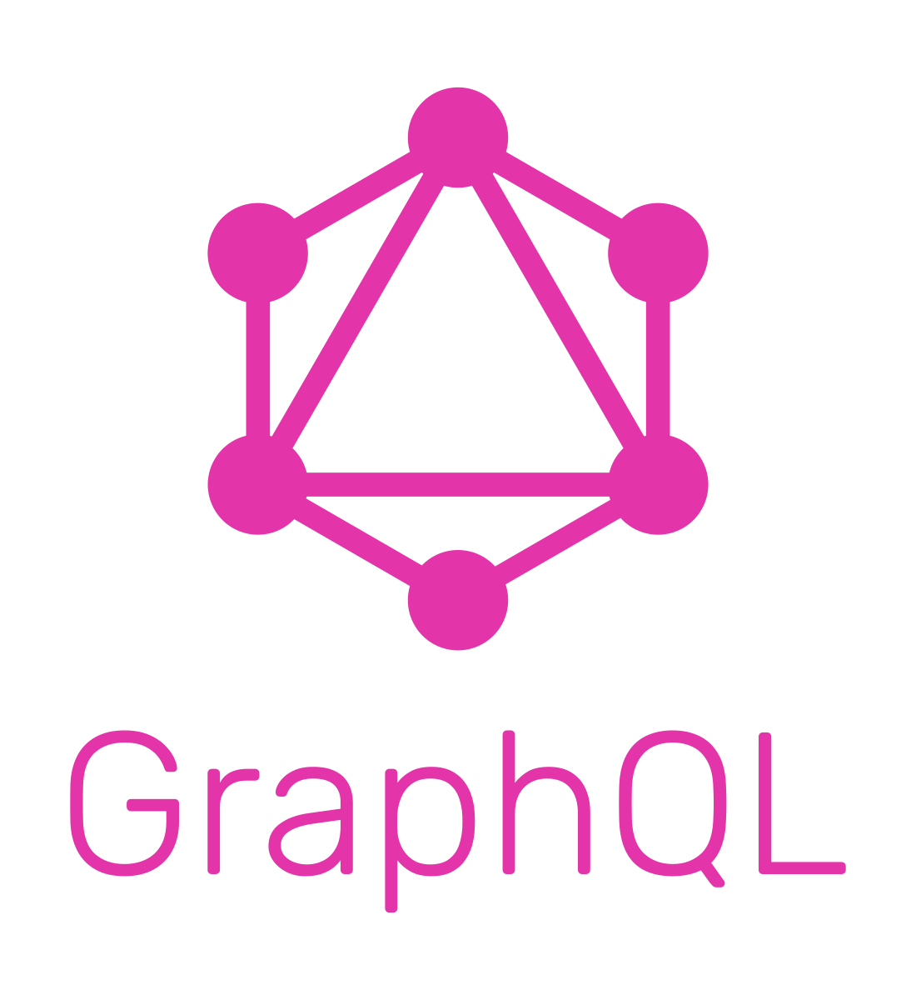
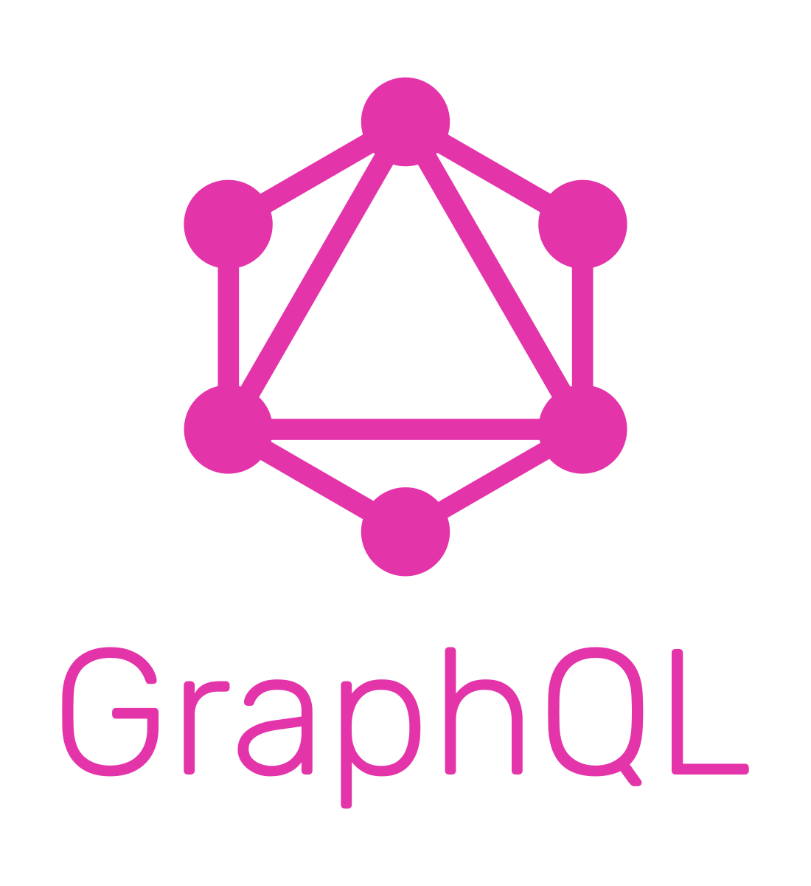
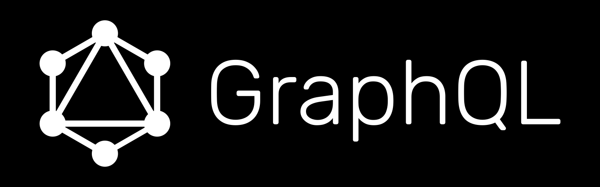
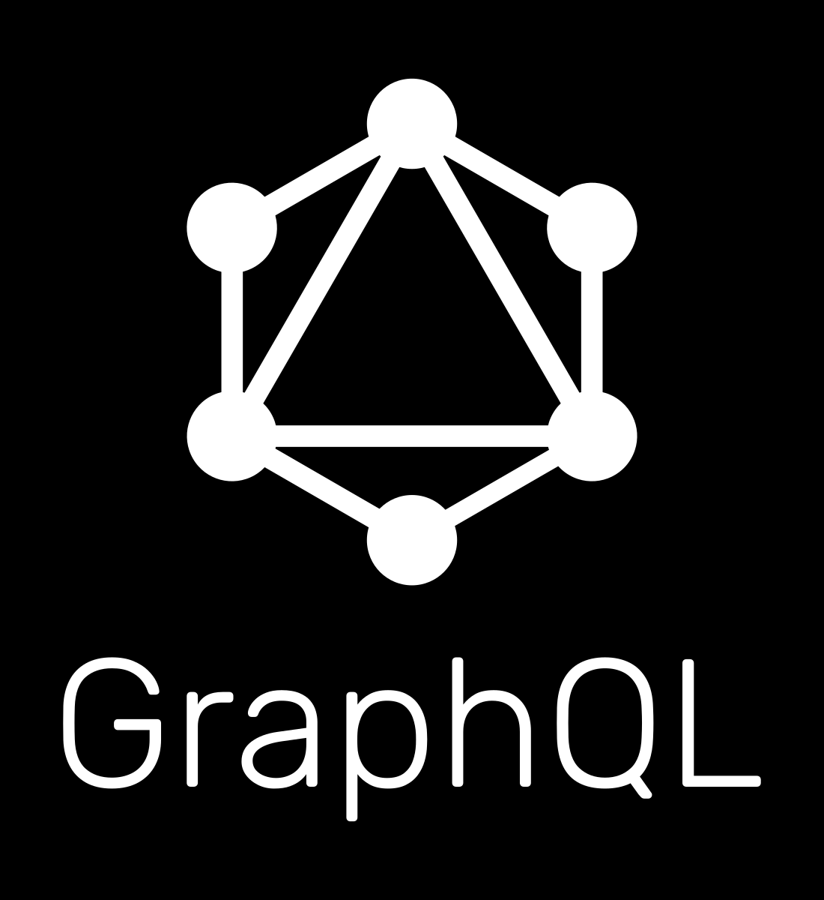
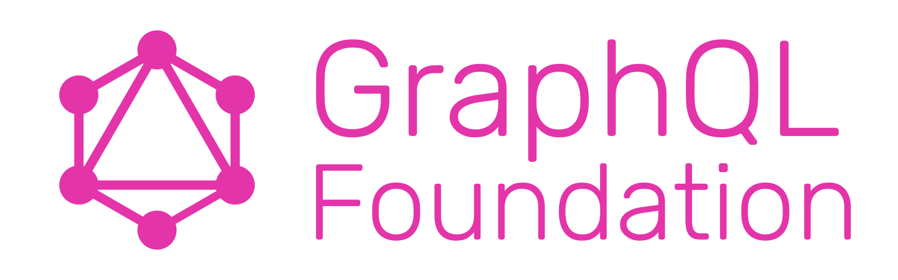
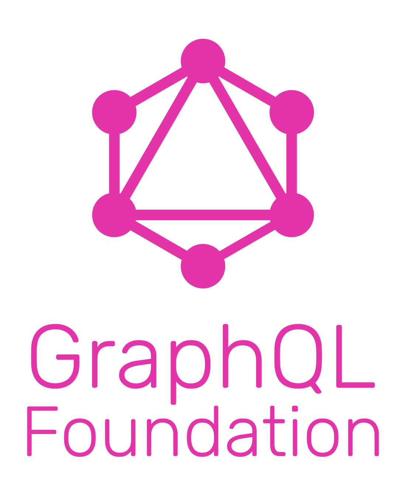
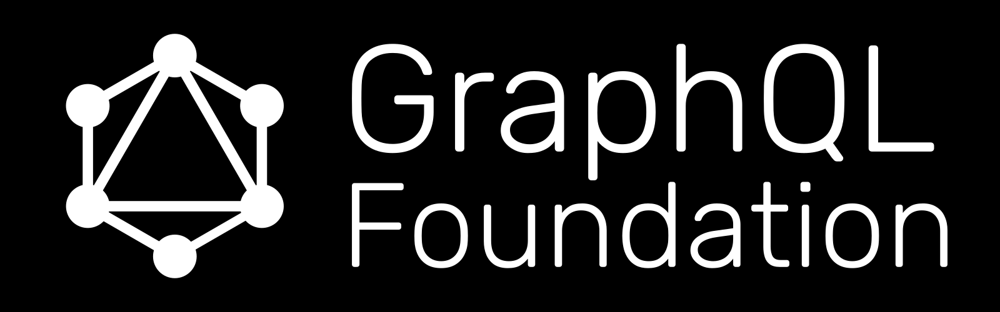
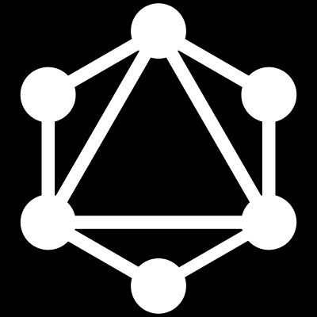
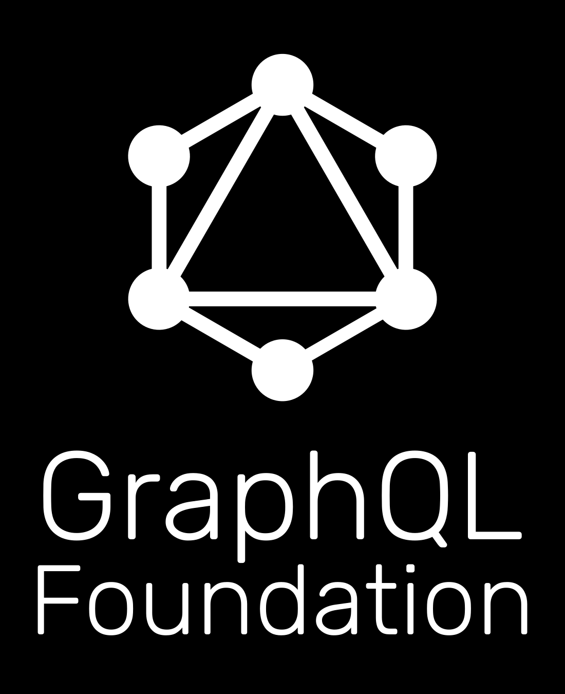
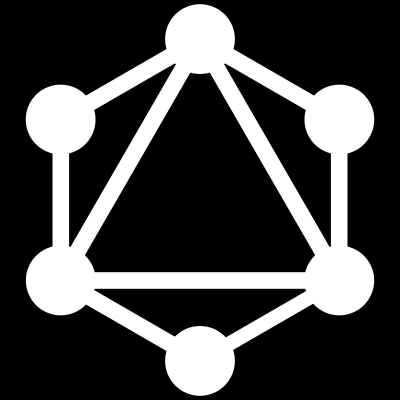

# GraphQL Foundation Artwork and Logos

Note: GitHub Flavored Markdown used in the Readme doesn't support background colors. The white logos below are displayed on the light grey of tables.

## Using the GraphQL name and logo

The GraphQL trademark is managed by The GraphQL Foundation. Use of any trademark or logo is subject to the trademark policy available at [lfprojects.org/policies/trademark-policy](https://lfprojects.org/policies/trademark-policy/).

Please note that certain uses of the GraphQL mark are pre-approved, such as factual references to the project. Other uses require permission first, such as creating stickers or apparel for sale, using the word GraphQL in domain names, or using the mark on printed materials, to name a few. You can find a more comprehensive list in the [trademark policy](https://lfprojects.org/policies/trademark-policy/).

Please email [info@graphql.org](mailto:info@graphql.org) with any questions or requests.

Questions? Please email [info@graphql.org](mailto:info@graphql.org).

### Color Palette

<table style="text-align:center">
	<tr>
		<th></th>
		<th width="175">RGB</th>
		<th width="175">CMYK</th>
		<th width="175">Pantone</th>
		<th width="175">Hex</th>
	</tr>
		<td></td>
		<td>(228, 52, 170)</td>
		<td>(0, 77, 25, 11)</td>
		<td>Rhodamine Red C</td>
		<td>#E434AA</td>
	</tr>
</table>

### Fonts

GraphQL uses [Rubik 300](https://fonts.google.com/specimen/Rubik?sidebar.open=true&selection.family=Rubik:wght@300&preview.text=GraphQL&preview.text_type=custom), freely available under the Open Font License.

### Logos

#### GraphQL

<table>
    <tr>
    	<th colspan="7"></th>
    </tr>
    <tr>
        <th></th>
        <th colspan="3">PNG</th>
        <th colspan="3">SVG</th>
    </tr>
    <tr>
        <th></th>
        <th>horizontal</th>
        <th>stacked</th>
        <th>icon</th>
        <th>horizontal</th>
        <th>stacked</th>
        <th>icon</th>
    </tr>
    <tr>
        <th>color</th>
        <td></td>
        <td></td>
        <td></td>
        <td></td>
        <td></td>
        <td></td>
    </tr>
    <tr>
        <th>black</th>
        <td></td>
        <td></td>
        <td></td>
        <td></td>
        <td></td>
        <td></td>
    </tr>
    <tr>
        <th>white</th>
        <td></td>
        <td></td>
        <td></td>
        <td></td>
        <td></td>
        <td></td>
    </tr>
</table>

#### GraphQL Foundation

<table>
    <tr>
    	<th colspan="7"></th>
    </tr>
    <tr>
        <th></th>
        <th colspan="3">PNG</th>
        <th colspan="3">SVG</th>
    </tr>
    <tr>
        <th></th>
        <th>horizontal</th>
        <th>stacked</th>
        <th>icon</th>
        <th>horizontal</th>
        <th>stacked</th>
        <th>icon</th>
    </tr>
    <tr>
        <th>color</th>
        <td></td>
        <td></td>
        <td></td>
        <td></td>
        <td></td>
        <td></td>
    </tr>
    <tr>
        <th>black</th>
        <td></td>
        <td></td>
        <td></td>
        <td></td>
        <td></td>
        <td></td>
    </tr>
    <tr>
        <th>white</th>
        <td></td>
        <td></td>
        <td></td>
        <td></td>
        <td></td>
        <td></td>
    </tr>
</table>

## Contributing to this repo

This repository is managed by EasyCLA. Project participants must sign the free ([GraphQL Specification Membership agreement](https://preview-spec-membership.graphql.org) before making a contribution. You only need to do this one time, and it can be signed by [individual contributors](http://individual-spec-membership.graphql.org/) or their [employers](http://corporate-spec-membership.graphql.org/).

To initiate the signature process please open a PR against this repo. The EasyCLA bot will block the merge if we still need a membership agreement from you.

You can find [detailed information here](https://github.com/graphql/graphql-wg/tree/main/membership). If you have issues, please email [operations@graphql.org](mailto:operations@graphql.org).

If your company benefits from GraphQL and you would like to provide essential financial support for the systems and people that power our community, please also consider membership in the [GraphQL Foundation](https://foundation.graphql.org/join).